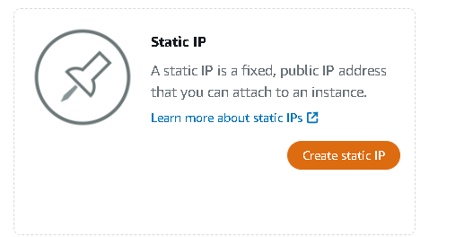

# Devops challenge júnior

Objetivo é demonstrar inteligência, capacidade e organização para realizar tarefas básicas para o cargo.

### Critérios de avaliação:

✔ Organização  
✔ Esforço  
✔ Entrega em si dos 2 Challenges  
✔ Documentação da entrega  

### → Challenge Dev:
> Resolva os 3 erros no plugin 
[Plugin DevOps Challenge](devops_challenge.php)

> Erros encontrados:

1. Adicionado tag de abertura do PHP -> Linha 1 
 

2. Adicionado ponto e vírgula (;) -> Linha 34 
 
 

3. Adicionado método "admin_notices" -> Linha 55 
 
 

### → Challenge Ops:

<li>Instalação e configuração de uma instância do serviço Amazon Lightsail </li>
<li>Configuração do ambiente </li> 
<li>Adicionando plugin ao WordPress </li>
<li>Arquitetura do sistema </li>  

<h2>1. Criar a instância<h2>
 
<h3>Considere:<h3>
<li>Região em que se encontra, para hospedar sua instância;</li>
<li>Sistema desejado;</li>
<li>Com qual aplicação deseja criar no ambiente;</li>

 

2. Escolher um nome único.
No nosso caso, utilizaremos *Apiki-Wordpress*

 

3. Conecte-se à sua instância via SSH.

 

4. Obter sua senha de acesso.
Com o comando *cat $HOME/bitnami_application_password* você pode vizualizar sua senha de acesso.

 

5. Na aba de *Redes*, crie um IP Estático.

 

6. Marque a instância criada e defina um nome único.

 

7. Já no Wordpress da aplicação, adicione um novo plugin.

 

*Obs: Você pode alterar o idioma do seu Wordpress em:*

 

8. Na aba de pesquisa procure pelo plugin *Code Snippet*.

 

9. Em seguida, adicione um novo trecho de código. 

10. Adicione um nome ao plugin e o respectivo código.

 

11. Plugin ativado e funcionando, com o cabeçalho das páginas podemos vizualizar.

 

*Acesso:*
URL: http://3.233.58.246/wp-login.php 
Usuário: admin-apiki 
Senha: nI4lpo7bKVua 
